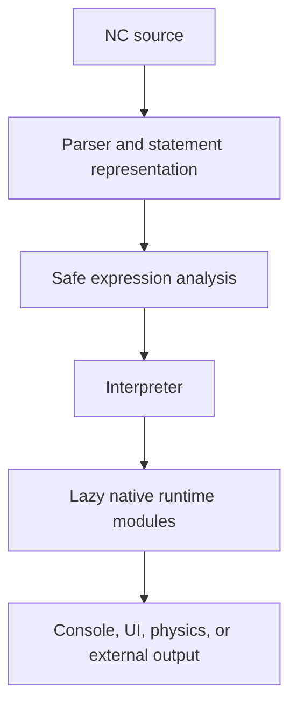

# NeuroConsole (NC)

> A readable, indentation-based programming language for console programs,
> desktop interfaces, real-world physics simulations, local tools, and web
> endpoints.

**Current release:** `1.2.0-alpha.1` (Alpha 1)  
**Runtime requirement:** 64-bit Python 3.12 or newer  
**Supported systems:** Windows 10/11, current Linux distributions, and current
macOS releases

> [!WARNING]
> NC 1.2.0 is an alpha release. Keep backups of important projects and report
> reproducible problems. The physics system is intended for games, learning,
> and general simulation—not safety-critical or engineering certification.

## What is NC?

NeuroConsole, or NC, is a small programming language and runtime focused on
clear source code, helpful errors, and practical built-in capabilities. NC uses
two-space indentation, forbids tabs, and keeps common language constructs
compact:

```nc
let total = 0

for value in range(1, 5):
  set total = total + value

fn double(value):
  ret value * 2

if total == 10:
  print double(total)
else:
  print "Unexpected result"
```

NC 1.2 adds three major runtime systems without changing the existing language
grammar:

- `physics2d` for fixed-step 2D rigid-body simulation
- `physics3d` for fixed-step 3D rigid bodies and dedicated cloth physics
- `ui.app` for event-driven desktop applications written directly in NC

It also introduces structured English diagnostics and installers for Windows,
Linux, and macOS.

## Highlights

| Area | Current capabilities |
|---|---|
| Language | Variables, conditions, loops, functions, lists, dictionaries, modules, imports, exports, and safe expression evaluation |
| 2D physics | Circles, boxes, convex polygons, forces, impulses, torque, friction, restitution, drag, joints, and custom force rules |
| 3D physics | Spheres, boxes, planes, forces, impulses, torque, friction, restitution, drag, joints, and visual 3D models |
| Cloth | Structural, shear, and bending constraints; pins, damping, wind, rigid-body collision, and image textures |
| Desktop UI | Windows, layouts, text, buttons, inputs, checkboxes, choices, sliders, progress bars, images, tables, canvas, timers, and callbacks |
| Diagnostics | Stable error codes, source excerpts, column markers, help text, related errors, import chains, and NC call stacks |
| Tools | `nc` console runner, `ncw` graphical runner, learn mode, encrypted NCE packages, and standalone executable builds |

Large optional systems are loaded lazily. A console-only or headless physics
program does not need to open a window or initialize a renderer.

## Quick start

### 1. Install Python

Install a **64-bit Python 3.12 or newer** build before installing NC.

### 2. Run the installer

Download or clone this repository, open its root folder, and use the installer
for your platform:

| Platform | Command or file |
|---|---|
| Windows | Run `install_nc.cmd` or `install_nc.bat` |
| Linux | `chmod +x install_nc.sh && ./install_nc.sh` |
| macOS | Double-click `Install_NC.command`, or run it from Terminal |

The installer:

- installs NC into `~/NC`;
- creates an isolated environment in `~/NC/.venv`;
- installs the required Python packages;
- adds the `nc` and `ncw` commands to the user PATH;
- preserves existing files inside `~/NC/standart_imports`; and
- runs a physics self-test after installation.

The folder name `standart_imports` is retained for backward compatibility.

Open a new terminal after installation and verify NC:

```console
nc --version
```

Expected output:

```text
NC 1.2.0-alpha.1
```

### 3. Run your first program

Create `hello.nc`:

```nc
let name = "world"
print "Hello, " + name + "!"
```

Run it with:

```console
nc hello.nc
```

Use `ncw` for programs that open graphical NC windows:

```console
ncw examples/ui_counter.nc
```

## Real-world physics in SI units

NC physics separates the simulation from its visual representation. A body's
size, mass, velocity, and collision shape use physical units; pixels, textures,
and model coordinates are renderer details. Resizing a window therefore does
not change gravity or collision behavior.

| Quantity | Unit |
|---|---|
| Position and size | metre (`m`) |
| Time | second (`s`) |
| Mass | kilogram (`kg`) |
| Force | newton (`N`) |
| Torque | newton-metre (`N m`) |
| Impulse | newton-second (`N s`) |
| Linear velocity | metre per second (`m/s`) |
| Angles | radians (`rad`) |

Standard gravity defaults to exactly `9.80665 m/s²`. The simulation uses a
fixed physics step that is independent of display frame rate. With the same
platform, Python build, starting state, callbacks, and step sequence, the
headless solvers are deterministic.

No finite floating-point simulation can reproduce the real world with literal
100% mathematical accuracy. NC instead provides controlled, repeatable
classical mechanics whose accuracy can be adjusted through the fixed step,
solver iterations, collision approximation, and material parameters.

### Physics 2D

```nc
import physics2d

let world = physics2d.world({
  "gravity": [0, -9.80665],
  "fixed_step": 0.008333333333333333,
  "solver_iterations": 10
})

let floor = world.static_box(18, 1, [0, -4], {
  "color": "#475569",
  "material": {"friction": 0.8, "restitution": 0.05}
})

let ball = world.circle(0.55, 1.2, [-1.5, 3], {
  "color": "#38bdf8",
  "material": {"friction": 0.45, "restitution": 0.72}
})

let app = physics2d.app(world, {
  "title": "NC Real Physics 2D",
  "width": 1100,
  "height": 720,
  "pixels_per_metre": 75
})

app.run()
```

Run the complete example:

```console
ncw examples/physics2d_balls.nc
```

### Physics 3D and cloth

```nc
import physics3d

let world = physics3d.world({
  "gravity": [0, 0, -9.80665],
  "fixed_step": 0.008333333333333333
})

let ground = world.plane([0, 0, 1], 0)
let pole = world.static_box([0.18, 0.18, 5], [-2.1, 0, 2.5])

let flag = world.cloth({
  "columns": 24,
  "rows": 15,
  "size": [3.8, 2.2],
  "origin": [-2, 0, 4.8],
  "orientation": "vertical",
  "pinned": "top",
  "mass": 0.9,
  "wind": [0, 5.5, 0.4],
  "structural_stiffness": 0.96,
  "shear_stiffness": 0.82,
  "bend_stiffness": 0.3
})

let app = physics3d.app(world, {
  "title": "NC 3D Cloth Physics",
  "camera_position": [8, -12, 7],
  "camera_target": [0, 0, 2.3]
})

app.run()
```

Run the complete example:

```console
ncw examples/physics3d_cloth.nc
```

This release implements **cloth surfaces only**. It intentionally does not
provide liquids, gases, or general-purpose soft bodies.

### Images, models, and collision geometry

| System | Visual resources |
|---|---|
| `physics2d` | PNG, JPG/JPEG, WebP, and SVG images |
| `physics3d` | GLB, glTF, and OBJ models |
| 3D cloth | Image textures |

Visual resources never silently become collision geometry. A detailed crate
model can use a stable box collider, and a circular 2D collider can use a
high-resolution image. This keeps rendering changes from unexpectedly changing
physical behavior.

Custom behavior can be added with `add_force_rule`, `on_fixed_step`, and
`on_collision` callbacks. See [PHYSICS_API.md](PHYSICS_API.md) for the complete
Alpha 1 API.

## Build desktop interfaces with `ui.app`

`ui.app` creates ordinary event-driven application windows directly from NC.
Callbacks execute in the NC process, and PySide6 is loaded only when
`app.run()` starts the graphical renderer.

```nc
import ui

let app = ui.app("NC Counter")
let window = app.window("NC Counter", 520, 300)
let output = window.text("0", {
  "style": {"font_size": 38, "color": "#38bdf8"}
})

let controls = window.row()
let add_button = controls.button("Add 1")
let reset_button = controls.button("Reset")

fn add_one():
  output.set_text(str(int(output.text()) + 1))

fn reset():
  output.set_text("0")

add_button.on_click(add_one)
reset_button.on_click(reset)
app.run()
```

Run it with:

```console
ncw examples/ui_counter.nc
```

See [UI_APP_API.md](UI_APP_API.md) for widgets, layouts, styles, timers, canvas
commands, state updates, and event callbacks.

## Structured diagnostics

Normal NC errors are written in English and show the location, the actual
source line, a stable error code, and a useful correction where possible:

```text
error NC-S1001: Missing ':' after if block header
  --> game.nc:12:16
   |
12 | if player.alive
   |                ^ expected ':'
13 |   player.move()
   |   ^ This indentation diagnostic is a consequence of the missing ':'.
   = help: Write `if player.alive:`
```

Related parser errors are connected to their cause instead of being presented
as unrelated mistakes. Runtime errors can include the NC function call stack,
and imported files can include an import chain. Python tracebacks are not shown
during normal execution.

Diagnostic families are documented in [DIAGNOSTICS.md](DIAGNOSTICS.md).

## Command-line overview

| Command | Purpose |
|---|---|
| `nc program.nc` | Run an NC program in the console host |
| `ncw program.nc` | Run an NC program with the graphical host |
| `nc --version` | Print the installed NC version |
| `nc --learn` | Open the built-in learn mode |
| `nc program.nc --exe` | Build a local NC program as a standalone executable with PyInstaller |
| `nc --pack-nce SOURCE OUTPUT` | Create an encrypted `.nce` package |
| `nc package.nce` | Run an encrypted `.nce` package |
| `nc program.nc --libs PATH` | Add a module search directory |

HTTPS imports are permitted by policy. Plain HTTP and private/localhost URL
imports require explicit CLI options. Private attribute access is blocked by
the expression evaluator. These controls reduce accidental exposure, but NC
must not be treated as a complete sandbox for hostile programs.

## Platform support

| Platform | Full Alpha 1 support | Installer |
|---|---:|---|
| Windows 10/11 | Yes | `.cmd` and `.bat` |
| Current Linux distributions | Yes | `.sh` |
| Current macOS releases | Yes | `.command` |
| Windows Vista, 7, 8, and 8.1 | No | Not compatible with the Python 3.12 and Qt 6 runtime |

The `.bat` installer is an alternative Windows command-script format; it does
not make modern Python or Qt compatible with unsupported Windows releases.
More installation details and custom target options are available in
[INSTALLING.md](INSTALLING.md).

## Architecture



Physics and direct UI are ordinary built-in modules rather than special syntax.
This keeps the parser stable and lets the runtime systems evolve behind a
consistent NC API.

| Component | Responsibility |
|---|---|
| `nc.py` | Existing language parser, interpreter, policy, and compatibility core |
| `nc_module_registry.py` | Lazy discovery of native built-in modules |
| `nc_runtime_support.py` | Validation, vectors, callbacks, resources, and fixed-step timing |
| `nc_physics2d.py` | Headless 2D physics state and solver |
| `nc_physics2d_app.py` | PySide6 2D renderer and input |
| `nc_physics3d.py` | Headless 3D rigid-body and cloth solver |
| `nc_physics3d_app.py` | Panda3D renderer and 3D model loading |
| `nc_ui_app.py` | Event-driven UI model and lazy Qt adapter |
| `nc_diagnostics.py` | Source registry, error classification, relations, and formatting |

See [ARCHITECTURE.md](ARCHITECTURE.md) for design and compatibility details.

## Alpha 1 boundaries

The following limitations are deliberate and documented:

- 2D polygon colliders must be convex.
- Built-in 3D box collision is currently axis-aligned. Boxes may rotate
  visually and keep angular state, but collision remains axis-aligned.
- Cloth receives collisions and movement from rigid bodies, but it does not yet
  transfer equal-and-opposite momentum back to them.
- Cloth is the only deformable-material system. Liquids, gases, and generic
  soft bodies are not included.
- Physical results depend on the fixed step, solver iterations, collision
  shapes, material parameters, and floating-point behavior.
- The full Python 3.12, PySide6, and Panda3D distribution does not support
  Windows Vista through Windows 8.1.

These constraints are kept explicit so a numerical approximation is never
mistaken for a feature the runtime does not actually implement.

## Development and tests

Run the complete headless test suite from the repository root:

```console
python -m unittest discover -s tests -v
```

The tests cover core language compatibility, module imports, diagnostics,
2D rigid bodies, 3D rigid bodies, cloth, determinism, callbacks, and headless UI
state. GUI dependencies are imported lazily, so the headless suite does not
require an active display server.

Contributions should preserve NC's two-space syntax and backward compatibility.
Changes to language behavior should be considered across the complete chain:

```text
source -> parser -> internal representation -> analysis -> interpreter
       -> runtime -> output
```

New behavior should include focused tests, clear English diagnostics, and an
update to the relevant documentation. Architecture quality, consistency, and
maintainability take priority over adding features quickly.

## Documentation

- [INSTALLING.md](INSTALLING.md) — installation and platform details
- [PHYSICS_API.md](PHYSICS_API.md) — 2D, 3D, cloth, callbacks, and rendering
- [UI_APP_API.md](UI_APP_API.md) — desktop UI API
- [DIAGNOSTICS.md](DIAGNOSTICS.md) — error codes and formatting rules
- [ARCHITECTURE.md](ARCHITECTURE.md) — runtime boundaries and design decisions
- [CHANGELOG.md](CHANGELOG.md) — release changes
