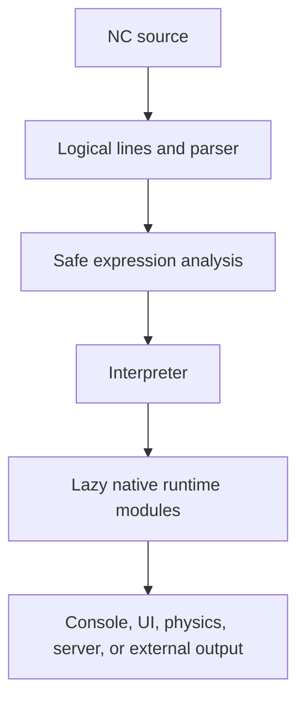

# NeuroConsole (NC)

> A readable, indentation-based programming language and runtime for console
> programs, desktop interfaces, real-world physics simulations, local tools,
> encrypted packages, and web endpoints.

**Current release:** `1.2.0-alpha.2` (Alpha 2)  
**Runtime requirement:** 64-bit Python 3.12 or newer  
**Supported systems:** Windows 10/11, current Linux distributions, and current
macOS releases

> [!WARNING]
> NC 1.2.0 is an alpha release. Keep backups of important projects and report
> reproducible problems. The physics system is intended for games, learning,
> and general simulation—not safety-critical or engineering certification.

## What is NC?

NeuroConsole, or NC, is a small programming language and runtime focused on
clear source code, helpful diagnostics, and practical built-in capabilities.
NC uses two-space indentation and forbids tabs. Existing NC syntax remains
compatible while larger systems are exposed through ordinary modules.

```nc
let total = 0

for value in range(1, 5):
  set total = total + value

fn double(value):
  ret value * 2

if total == 10:
  print double(total)
else:
  print "Unexpected result"
```

## Capabilities at a glance

| Area | Capabilities |
|---|---|
| Core language | Variables, expressions, conditions, loops, functions, return values, lists, dictionaries, modules, imports, exports, and safe expression evaluation |
| Console output | `print`, colors, tables, plots, timers, logs, buttons, checkmarks, inputs, and horizontal interactive rows |
| Desktop UI | Windows, rows, columns, text, buttons, inputs, checkboxes, choices, sliders, progress bars, images, tables, canvas, timers, keyboard events, and callbacks |
| TWIN host | NC output windows, HTML, JavaScript bridges, buttons, tables, plots, input controls, and graphical `.ncw` execution |
| Physics 2D | Circles, boxes, convex polygons, forces, impulses, torque, friction, restitution, drag, joints, sensors, callbacks, and image resources |
| Physics 3D | Spheres, axis-aligned boxes, planes, forces, impulses, torque, friction, restitution, drag, joints, callbacks, and GLB/glTF/OBJ models |
| Cloth | Structural, shear, and bending constraints; pins, damping, wind, rigid-body collision, and image textures |
| Web and local tools | NC HTTP endpoints, static files, JSON/form requests, local modules, HTTPS imports, and standard-library integrations |
| Packaging | Console execution, graphical execution, encrypted `.nce` packages, and PyInstaller standalone builds |
| Diagnostics | Stable error families, source excerpts, columns, help text, import chains, NC call stacks, and related errors |
| Tooling | `nc`, `ncw`, learn mode, installers, examples, headless tests, and portable version selection |

Large optional systems are loaded lazily. A console-only or headless physics
program does not need to open a window or initialize a renderer.

## Installation

Install a **64-bit Python 3.12 or newer** build before installing NC. The NC
installer does not replace Python or change the Python installation. It creates
an isolated environment for NC and installs NC's dependencies into that
environment.

### Windows

Run one of these files from the NC package folder:

```console
install_nc.cmd
```

or:

```console
install_nc.bat
```

### Linux

```console
chmod +x install_nc.sh
./install_nc.sh
```

### macOS

Double-click `Install_NC.command`, or run:

```console
chmod +x Install_NC.command
./Install_NC.command
```

The installer normally uses `~/NC`, creates `~/NC/.venv`, preserves the
`standart_imports/` directory, installs dependencies, adds `nc` and `ncw` to
the user command path, and runs a physics self-test. Open a new terminal after
the installation so the updated PATH is visible.

Verify the installation:

```console
nc --version
nc program.nc
ncw graphical_program.nc
```

The folder name `standart_imports` is retained for backward compatibility.

### Installing more than one NC version

If an older NC installation already exists, the installer can overwrite it or
install the new version beside it as `NC (version)`:

```console
python install_nc.py --overwrite
python install_nc.py --additional
```

The normal `nc` and `ncw` commands select the newest installed version. A
specific version can be selected explicitly:

```console
nc --1.2.0-alpha.2 program.nc
ncw --1.2.0-alpha.2 graphical_program.nc
```

If a command-line option requires a value, provide that value. For example:

```console
nc --base path/to/project --libs path/to/libs program.nc
```

## Core language

NC source files use two spaces per indentation level. Tabs are rejected so
that indentation has one consistent meaning on every platform.

### Variables and expressions

```nc
let name = "Tristan"
let score = 10
let items = ["wood", "stone", "iron"]
let player = {"name": name, "score": score}

set score = score + 5
print player.name
print items[0]
```

The runtime supports strings, numbers, booleans, `None`, lists, dictionaries,
attribute access, indexing, slices, arithmetic, comparisons, boolean
operators, conditional expressions, and safe calls to approved NC/Python
runtime functions.

### Conditions, loops, and functions

```nc
if score >= 15:
  print "Level up"
elif score > 0:
  print "Keep going"
else:
  print "No score"

repeat 3 times:
  print " 반복"

for item in items:
  print item

fn add(first, second):
  ret first + second

print add(2, 3)
```

NC also supports `while`, `break`, `continue`, `ret`/`return`, nested
structures, recursion, and the existing compatibility forms supported by the
interpreter.

### Modules, imports, and exports

```nc
# math_tools.nc
let answer = 42
fn double(value):
  ret value * 2
export answer
export double
```

```nc
import math_tools
print math_tools.answer
print math_tools.double(21)
```

NC resolves local modules, project `libs` directories, configured library
paths, `standart_imports/`, and supported remote imports. HTTPS imports are
allowed by policy. Plain HTTP and private/localhost imports require explicit
command-line permission:

```console
nc --allow-http --allow-private program.nc
```

Private attribute access is blocked by the expression policy. NC is designed
for practical local programs, not as a complete sandbox for hostile code.

## Console programs and controls

The console host supports ordinary output as well as interactive controls.
When several controls are written on one source line, they are rendered in a
single horizontal row.

```nc
print "Hello, world!"
print "Score:" print score
button "Play" button "Settings" button "Exit"
(sound) = checkmark "Sound" (music) = checkmark "Music"
(name) = input "Name" (country) = input "Country"
```

In an interactive terminal, use the left and right arrow keys to select a
control and Enter to activate it. A selected button is exposed through
`__last_button__` and `__last_button_index__`. A selected input stores its text
in the named variable and in `__last_input__`.

Normal block buttons remain available:

```nc
let counter = 0

button "Add":
  let message = "Added one"
  counter = counter + 1
  set counter = counter + 1
  action:
    print message
    print counter
```

The statements before `action:` are evaluated when that button is selected.
They may use `let`, `set`, and ordinary assignment. This allows several
preparation lines to build state before the action body runs.

The compatibility UI statements `window`, `size`, `table`, `plot`, `tick`,
text color commands, and HTML/TWIN output remain available where supported by
the selected host.

## Desktop interfaces with `ui.app`

`ui.app` creates event-driven desktop windows directly from NC. The UI model
can be tested without opening a window, and PySide6 is loaded only when
`app.run()` starts the graphical renderer.

```nc
import ui

let app = ui.app("NC Counter")
let window = app.window("NC Counter", 520, 300)
let output = window.text("0", {
  "style": {"font_size": 38, "color": "#38bdf8"}
})

let controls = window.row()
let add_button = controls.button("Add 1")
let reset_button = controls.button("Reset")

fn add_one():
  output.set_text(str(int(output.text()) + 1))

fn reset():
  output.set_text("0")

add_button.on_click(add_one)
reset_button.on_click(reset)
app.run()
```

The UI API includes:

- application windows, timers, quitting, and last-error reporting;
- rows, columns, spacers, visibility, enabled state, tooltips, and styles;
- text, buttons, inputs, checkboxes, choices, sliders, and progress bars;
- images, tables, canvas drawing, and state updates; and
- click, change, submit, keyboard, and close callbacks.

Run a graphical NC UI program with:

```console
ncw examples/ui_counter.nc
```

See [UI_APP_API.md](UI_APP_API.md) for the complete API.

## TWIN graphical host

`ncw` runs NC programs with the TWIN graphical host. It understands the
structured `__TWIN__` output emitted by the compatibility UI layer and can
display windows, buttons, text, inputs, tables, HTML, JavaScript responses,
plots, and error dialogs.

```console
ncw program.nc
ncw program.nc --base path/to/project --libs path/to/libs
```

The normal `nc` command is the console host. Use `nc --no-ui` when TWIN output
must be disabled, for example in a headless process or automated test.

## Real-world physics in SI units

NC physics separates simulation state from its visual representation. A
body's size, mass, velocity, and collision shape use physical units; pixels,
textures, and model coordinates belong to the renderer.

| Quantity | Unit |
|---|---|
| Position and size | metre (`m`) |
| Time | second (`s`) |
| Mass | kilogram (`kg`) |
| Force | newton (`N`) |
| Torque | newton-metre (`N m`) |
| Impulse | newton-second (`N s`) |
| Linear velocity | metre per second (`m/s`) |
| Angles | radians (`rad`) |

Standard gravity defaults to exactly `9.80665 m/s²`. Physics uses a fixed-step
simulation independent of display frame rate. With the same platform, Python
build, starting state, callbacks, and step sequence, headless solvers are
deterministic.

No finite floating-point simulation reproduces the real world with literal
100% mathematical accuracy. NC provides controlled, repeatable classical
mechanics whose accuracy depends on the fixed step, solver iterations,
collision approximation, and material parameters.

### Physics 2D

```nc
import physics2d

let world = physics2d.world({
  "gravity": [0, -9.80665],
  "fixed_step": 0.008333333333333333,
  "solver_iterations": 10
})

let floor = world.static_box(18, 1, [0, -4], {
  "color": "#475569",
  "material": {"friction": 0.8, "restitution": 0.05}
})

let ball = world.circle(0.55, 1.2, [-1.5, 3], {
  "color": "#38bdf8",
  "material": {"friction": 0.45, "restitution": 0.72}
})

let app = physics2d.app(world, {
  "title": "NC Real Physics 2D",
  "width": 1100,
  "height": 720,
  "pixels_per_metre": 75
})

app.run()
```

Physics 2D supports circles, boxes, convex polygons, static bodies, distance
joints, materials, gravity scaling, damping, drag, sensors, images, forces,
impulses, torque, snapshots, and fixed-step/collision callbacks. Polygon
colliders must be convex.

### Physics 3D and cloth

```nc
import physics3d

let world = physics3d.world({
  "gravity": [0, 0, -9.80665],
  "fixed_step": 0.008333333333333333
})

let ground = world.plane([0, 0, 1], 0)
let pole = world.static_box([0.18, 0.18, 5], [-2.1, 0, 2.5])

let flag = world.cloth({
  "columns": 24,
  "rows": 15,
  "size": [3.8, 2.2],
  "origin": [-2, 0, 4.8],
  "orientation": "vertical",
  "pinned": "top",
  "mass": 0.9,
  "wind": [0, 5.5, 0.4],
  "structural_stiffness": 0.96,
  "shear_stiffness": 0.82,
  "bend_stiffness": 0.3
})

let app = physics3d.app(world, {
  "title": "NC 3D Cloth Physics",
  "camera_position": [8, -12, 7],
  "camera_target": [0, 0, 2.3]
})

app.run()
```

Physics 3D supports spheres, boxes, planes, distance joints, forces,
impulses, torque, materials, damping, drag, callbacks, and GLB, glTF, and OBJ
visual models. The built-in box collision model is currently axis-aligned;
boxes may rotate visually and retain angular state, but their collision shape
does not yet use arbitrary orientation.

Cloth supports structural, shear, and bending constraints, pins, damping, wind,
textures, and rigid-body collision. Cloth is the only deformable-material
system in this release. Liquids, gases, and generic soft bodies are not
included, and cloth does not yet transfer equal-and-opposite momentum back to
rigid bodies.

Run the complete examples:

```console
ncw examples/physics2d_balls.nc
ncw examples/physics3d_cloth.nc
ncw examples/physics3d_arena.nc
```

See [PHYSICS_API.md](PHYSICS_API.md) for the complete API.

### Images, models, and collision geometry

| System | Visual resources |
|---|---|
| `physics2d` | PNG, JPG/JPEG, WebP, and SVG images |
| `physics3d` | GLB, glTF, and OBJ models |
| 3D cloth | Image textures |

Visual resources never silently become collision geometry. A detailed crate
model can use a stable box collider, and a circular 2D collider can use a
high-resolution image.

Custom behavior can be added with `add_force_rule`, `on_fixed_step`, and
`on_collision` callbacks.

## Web endpoints and local tools

The NC server can serve web files and execute NC endpoint files. It supports
the existing local project layout, JSON and form request data, common HTTP
methods, static resources, and structured NC errors. Start the server through
the existing NC server entry point or use the server integration from a local
NC project.

NC can also use ordinary local modules and approved Python standard-library
capabilities through the safe runtime bridge. Private Python attributes and
unsafe expression constructs remain blocked by policy.

## Encrypted `.nce` packages

NC can create and run encrypted NCE packages:

```console
nc --pack-nce project.nc project.nce --nce-password "choose-a-password"
nc project.nce --nce-password "choose-a-password"
```

For a folder with several source files, specify the entry file when needed:

```console
nc --pack-nce project_folder project.nce --nce-entry main.nc
```

NCE protects the package contents against casual inspection. It is not a
replacement for operating-system security or a complete hostile-code sandbox.

## Standalone executable builds

Build a local NC program as a standalone executable with PyInstaller:

```console
nc program.nc --exe
```

The generated build contains the NC runtime and the main `.nc` source, so NC
does not need to be installed on the target computer. External imports, images,
models, sounds, and other project assets must still be included in the project
bundle and copied with the generated application.

Use `ncw` for a graphical TWIN application:

```console
ncw program.nc --exe
```

`nc program.nc --exe` is the console export path. A program that uses the
physics runtime can still open its ordinary window when run through `ncw`; a
console executable deliberately keeps console behavior.

PyInstaller must be available in the NC environment. The build options are
platform-dependent and should be run on the target platform. Native macOS
disk-image and Linux AppImage conversion require their respective native
packaging tools; they are not portable cross-compilation features.

## Structured diagnostics

Normal NC errors are written in English and show the location, actual source
line, stable error code, and a useful correction where possible:

```text
error NC-S1001: Missing ':' after if block header
  --> game.nc:12:16
   |
12 | if player.alive
   |                ^ expected ':'
13 |   player.move()
   |   ^ This indentation diagnostic is a consequence of the missing ':'.
   = help: Write `if player.alive:`
```

Related parser errors are connected to their cause instead of being presented
as unrelated mistakes. Runtime errors can include the NC function call stack,
and imported files can include an import chain. Python tracebacks are not shown
during normal execution.

Diagnostic families are documented in [DIAGNOSTICS.md](DIAGNOSTICS.md).

## Command-line overview

| Command | Purpose |
|---|---|
| `nc program.nc` | Run an NC program in the console host |
| `ncw program.nc` | Run an NC program with the graphical/TWIN host |
| `nc --version` | Print the installed NC version |
| `nc --learn` | Open the built-in learn mode |
| `nc --learn topic` | Open learn mode for a topic |
| `nc program.nc --exe` | Build a console standalone executable with PyInstaller |
| `ncw program.nc --exe` | Build a graphical/TWIN standalone executable |
| `nc --pack-nce SOURCE OUTPUT` | Create an encrypted `.nce` package |
| `nc package.nce` | Run an encrypted `.nce` package |
| `nc program.nc --base PATH` | Set the base folder or URL for imports |
| `nc program.nc --libs PATH` | Add a library search path; repeatable |
| `nc program.nc --no-ui` | Disable TWIN output |
| `nc program.nc --no-log` | Disable step logs |
| `nc program.nc --allow-http` | Permit HTTP imports |
| `nc program.nc --allow-private` | Permit private/localhost URL imports |
| `nc --1.2.0-alpha.2 program.nc` | Run a specific installed NC version |

Options such as `--base` and `--libs` require a following value. Running `nc`
without a target displays the command help; it does not execute a source file.

## Platform support

| Platform | Alpha 2 support | Installer |
|---|---:|---|
| Windows 10/11 | Yes | `install_nc.cmd` or `install_nc.bat` |
| Current Linux distributions | Yes | `install_nc.sh` |
| Current macOS releases | Yes | `Install_NC.command` |
| Windows Vista, 7, 8, and 8.1 | No | Not compatible with the Python 3.12 and Qt 6 runtime |

The `.bat` installer is an alternative Windows command-script format. It does
not make modern Python or Qt compatible with unsupported Windows releases.

## Architecture



| Component | Responsibility |
|---|---|
| `nc.py` | Language parser, interpreter, policy, compatibility core, NCE support, and built-in bridges |
| `nc_console.py` | Console runner, command-line options, NCE packaging, and PyInstaller console export |
| `nc_twin_run.py` | Graphical TWIN host, graphical execution, and PyInstaller TWIN export |
| `nc_module_registry.py` | Lazy discovery of native built-in modules |
| `nc_runtime_support.py` | Validation, vectors, callbacks, resources, and fixed-step timing |
| `nc_physics2d.py` | Headless 2D physics state and solver |
| `nc_physics2d_app.py` | PySide6 2D renderer and input |
| `nc_physics3d.py` | Headless 3D rigid-body and cloth solver |
| `nc_physics3d_app.py` | Panda3D renderer and 3D model loading |
| `nc_ui_app.py` | Event-driven UI model and lazy Qt adapter |
| `nc_server.py` | Local HTTP server and endpoint handling |
| `nc_diagnostics.py` | Source registry, error classification, relations, and formatting |
| `t_windows.py` | TWIN message and compatibility-window support |

Physics and direct UI are ordinary built-in modules rather than special parser
syntax. This keeps the language grammar stable and lets runtime systems evolve
behind a consistent NC API.

## Alpha 2 boundaries

The following limitations are deliberate and documented:

- 2D polygon colliders must be convex.
- Built-in 3D box collision is currently axis-aligned.
- Cloth collision coupling is one-way in this release.
- Cloth is the only deformable-material system; liquids, gases, and generic
  soft bodies are not included.
- Numerical results depend on the fixed step, solver iterations, collision
  shapes, material parameters, and floating-point behavior.
- GUI renderers require their platform dependencies and an available display.
- Native disk-image/AppImage packaging requires a build on the corresponding
  operating system and its native packaging tools.

## Development and tests

Run the headless test suite from the repository root:

```console
python -m unittest discover -s tests -v
```

The tests cover core language compatibility, module imports, diagnostics,
horizontal controls, installer version selection, 2D rigid bodies, 3D rigid
bodies, cloth, determinism, callbacks, and headless UI state. GUI dependencies
are imported lazily, so the headless suite does not require an active display
server.

Changes to language behavior should be considered across the complete chain:

```text
source -> logical-line processing -> parser -> internal representation
       -> analysis -> interpreter -> runtime -> output
```

New behavior should include focused tests, clear English diagnostics, and an
update to the relevant documentation. Architecture quality, consistency,
maintainability, safety, and backward compatibility take priority over adding
features quickly.

## Documentation

- [INSTALLING.md](INSTALLING.md) — installation and platform details
- [PHYSICS_API.md](PHYSICS_API.md) — 2D, 3D, cloth, callbacks, and rendering
- [UI_APP_API.md](UI_APP_API.md) — desktop UI API
- [DIAGNOSTICS.md](DIAGNOSTICS.md) — error codes and formatting rules
- [ARCHITECTURE.md](ARCHITECTURE.md) — runtime boundaries and design decisions
- [CHANGELOG.md](CHANGELOG.md) — release changes
- [RELEASE_NOTES_1.2.0-alpha.2.md](RELEASE_NOTES_1.2.0-alpha.2.md) — Alpha 2 release summary

## Required installation files

The release archive is the safest download because it preserves the complete
file set and the empty `standart_imports/` directory. If the files are copied
individually, use the complete list at the bottom of
[RELEASE_NOTES_1.2.0-alpha.2.md](RELEASE_NOTES_1.2.0-alpha.2.md). Do not copy
only `install_nc.py`: the installer needs the NC runtime files, dependencies,
launchers, and `standart_imports/` from the same release.
